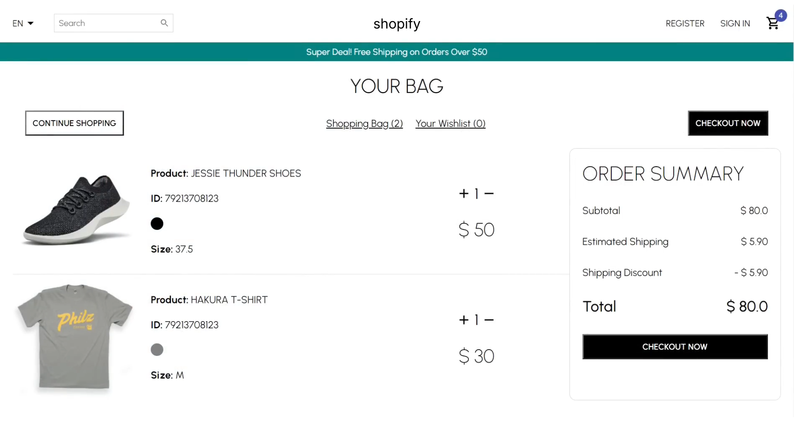

# eCommerce Platform

An eCommerce UI built from scratch, including essential components such as a navbar, product slider, category pages, single product pages, newsletter, login/register forms, and a shopping cart. The project focuses on practicing React component structuring, modular styling, and responsive design while creating a real-world eCommerce layout.

---

## Project Images




---

## Technologies

- React.js  
- Styled Components  
- CSS  
- Vite 

---

## Features

- Responsive navbar with logo, navigation links, and cart icon  
- React-based product slider with smooth transitions  
- Dynamic category pages and product cards with hover animations  
- Single product pages showing images, description, price, and add-to-cart button  
- Newsletter sign-up section and footer with links and social icons  
- Login and register form UI components  
- Interactive shopping cart showing selected products and totals  
- Fully responsive layout using media queries and flexible grids/flexbox  

---

## Running the Project

1. Clone the repository:
   ```bash
   git clone https://github.com/ssharpalla2002/eCommerce_Platform.git
   ```

2. Install dependencies:
   ```bash
   npm install
   ```

3. Start the development server:
   ```bash
   npm run dev
   ```

4. Open the application in your browser:
   ```
   http://localhost:5173
   ```

